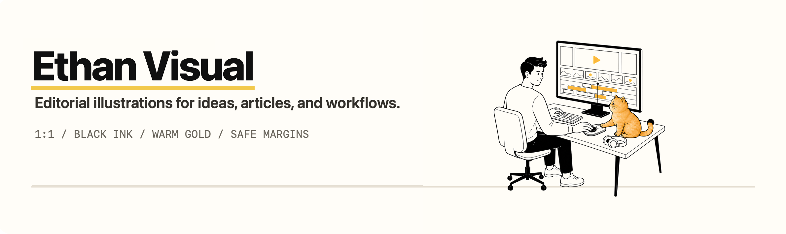

<p align="center">
  
</p>

<p align="center">
  <strong>一个专注于文字类配图的轻松、克制型 Codex 插画 Skill。</strong><br />
  固定的核心人物 · 符合场景逻辑的姿势 · 适时出现的金渐层小猫
</p>

## 这是什么

`ethan-visual` 可以把“设计 UI 界面”“整理日程表”等简短主题，转化为原创的方形插画。整体视觉保持克制：黑色手绘线条、留白、暖金色点缀，以及少量符合场景的细节。

## 视觉体系预览

以下是 Skill 中实际收录的参考产出，不是泛用的装饰素材。

<p align="center">
  
  
  
  
</p>

## 安装

将 Skill 目录复制到 Codex 的 skills 文件夹：

```bash
mkdir -p "$CODEX_HOME/skills"
cp -R skills/ethan-visual "$CODEX_HOME/skills/ethan-visual"
```

安装完成后，重新启动 Codex 或新建一个任务，Skill 就会生效。

## 使用方法

可以显式调用，也可以让主题自动触发：

```text
使用 $ethan-visual，生成一张“设计 UI 界面”的 1:1 插画。
```

Skill 会让核心人物出现在每张图中，并让人物的身体和视线朝向场景中的相关对象，同时保留四周至少 12% 的纯白安全边距，避免画面被裁切。小猫是可选元素：默认约有 70% 的单张插画包含小猫，也可以根据指令明确要求出现或不出现。

## 视觉规则

- 成年、平静、带一点轻松感的编辑式线稿；避免写实、3D、霓虹、光泽效果和 Q 版比例。
- 黑色轮廓搭配白色、浅奶油色和暖金色填充，仅保留有限的模拟印刷纹理。
- 默认输出方形 `1:1` 图片，画面中不添加可读文字。
- 场景点缀元素约占画布的 10–15%，并始终服务于核心人物。
- 所有元素都留在画布内部，四周至少保留 12% 的纯白安全边距。

## 仓库结构

```text
skills/ethan-visual/
├── SKILL.md
├── agents/openai.yaml
└── assets/
    ├── ethan-human-reference.png
    ├── ethan-cat-reference.png
    ├── ethan-open-eye-reference.png
    └── ethan-accent-sample.png
```

详细的生成流程和提示词模板请参阅 [`skills/ethan-visual/SKILL.md`](./skills/ethan-visual/SKILL.md)。
