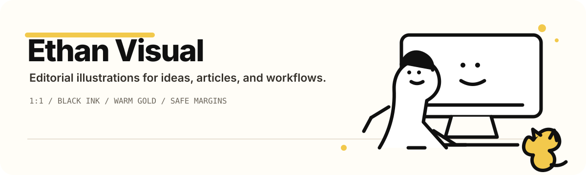
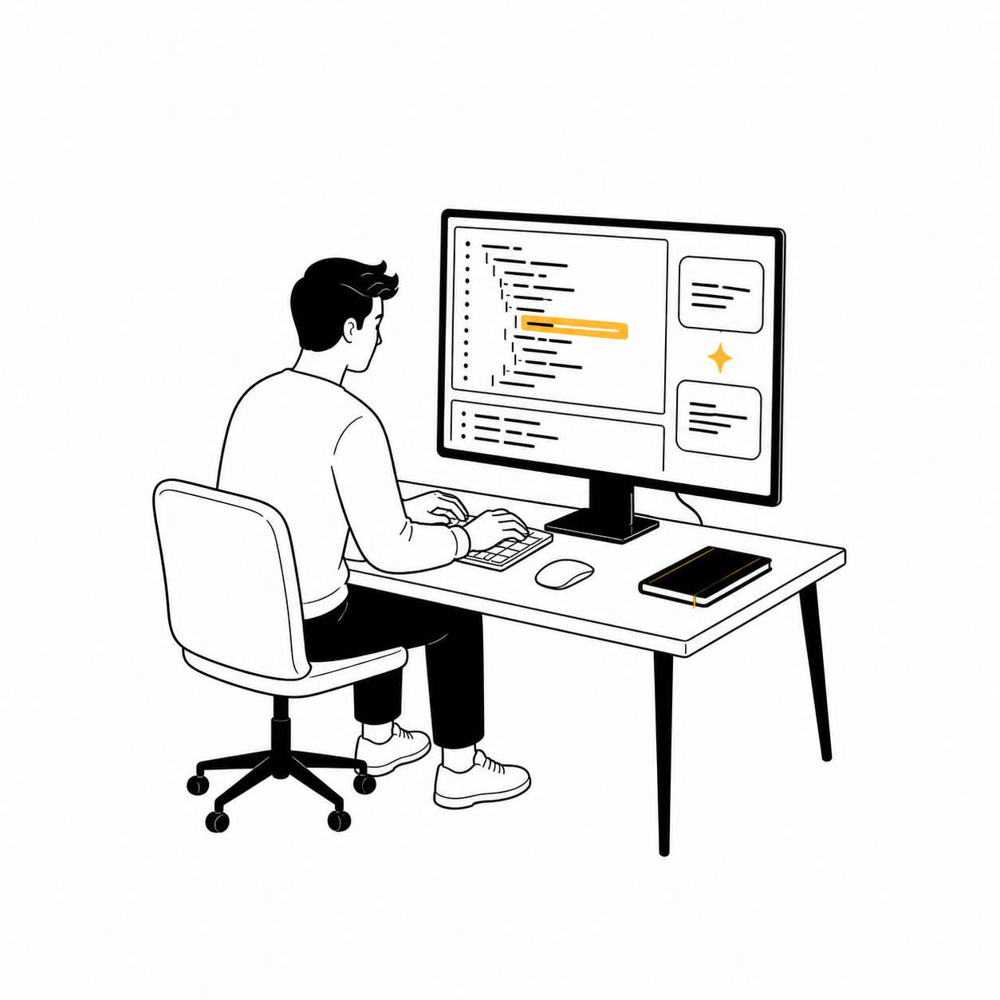
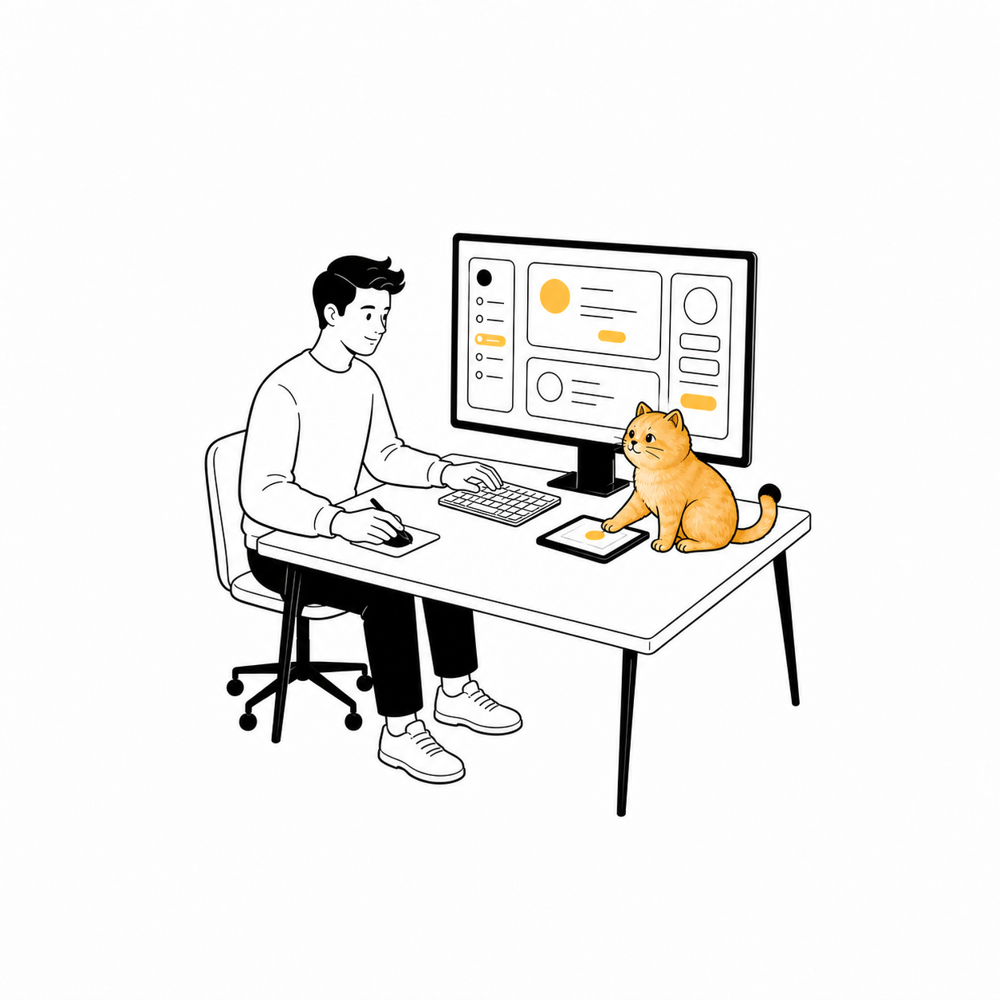

<p align="center">
  
</p>

<p align="center">
  <strong>A focused Codex skill for calm, text-oriented editorial illustrations.</strong><br />
  One recurring protagonist. Logical scene poses. A golden-shaded cat when it belongs.
</p>

## What it is

`ethan-visual` turns a short topic—such as “design a UI interface” or “organize a schedule”—into an original square illustration. The visual language stays intentionally restrained: black hand-drawn lines, white space, warm gold accents, and a small amount of contextual detail.

## See the visual system

These are real reference outputs bundled with the Skill, not generic stock decoration.

<p align="center">
  
  
  
  
</p>

## Install

Copy the Skill directory into your Codex skills folder:

```bash
mkdir -p "$CODEX_HOME/skills"
cp -R skills/ethan-visual "$CODEX_HOME/skills/ethan-visual"
```

Restart or start a new Codex task after installation so the Skill is available.

## Use it

Invoke it explicitly, or let the topic trigger it:

```text
Use $ethan-visual to create a 1:1 illustration about designing a UI interface.
```

The Skill keeps the human protagonist in every image, orients the body and gaze toward the relevant object, and maintains a 12% blank white safety margin so artwork is not clipped. The cat is optional by design: it appears in roughly 70% of single illustrations by default and can be explicitly included or omitted.

## Visual rules

- Adult, calm, lightly humorous editorial line art; never photorealistic, 3D, neon, glossy, or chibi.
- Black outlines with white, pale cream, and warm golden fills; limited analog/print texture.
- Square `1:1` output with no readable text by default.
- Small contextual accents occupy about 10–15% of the canvas and remain subordinate to the protagonist.
- All elements stay inside the canvas with at least 12% blank white margin on every side.

## Repository layout

```text
skills/ethan-visual/
├── SKILL.md
├── agents/openai.yaml
└── assets/
    ├── ethan-human-reference.png
    ├── ethan-cat-reference.png
    ├── ethan-open-eye-reference.png
    └── ethan-accent-sample.png
```

The detailed generation workflow and prompt skeleton live in [`skills/ethan-visual/SKILL.md`](./skills/ethan-visual/SKILL.md).
